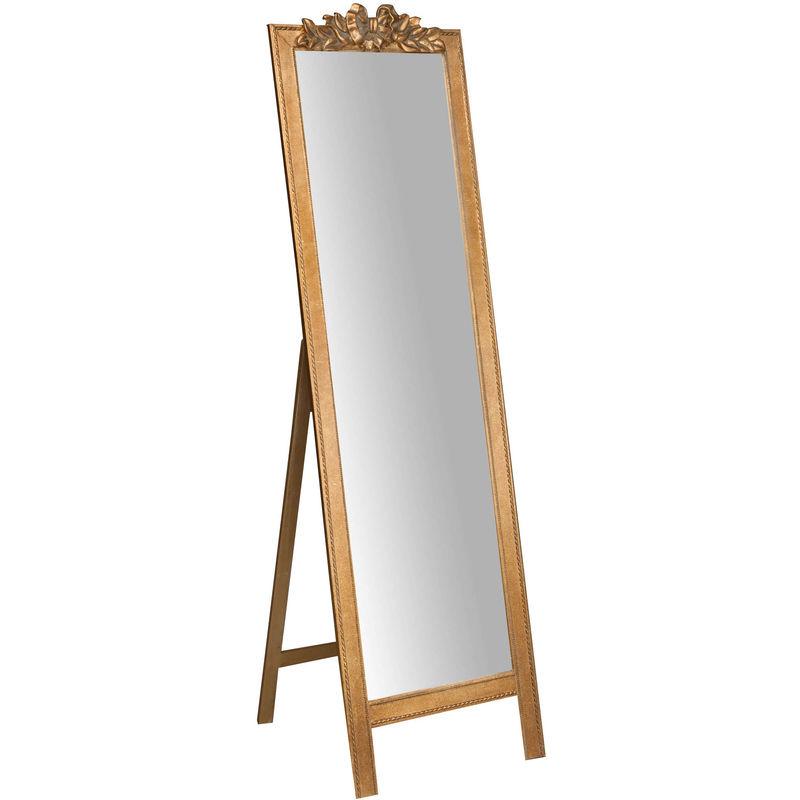
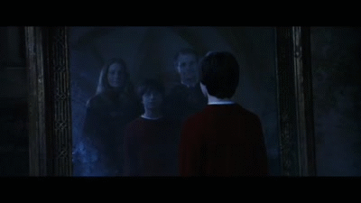

#  Miroir Magique  
## Concept  
Un miroir augmenté avec de la réalité augmenté projetté sur le miroir en question.  
La projection pourrait être différente quand on sort et entre dans le champ de vision du miroir.

## Type de miroir  
  

## Aspect technique  
Comme je ne suis pas sûr que la projection se voie très bien je pensais plus à un faux miroir avec une caméra qui filme devant elle et qui retrensemet en direct l'image dans l'ordinateur pour que le projecteur la projette.

## Idée de projection sur le miroir  
- Un apperçu du futur entre autre pour dénoncé la polution, le réchauffement climatique ou autre problématique qui ont un impaque majeure sur notre futur.
- Les parents d'Harry Potter.  
  

## Exemple de Miroir Magique 
<iframe width="560" height="315" src="https://www.youtube.com/embed/YXzvnnJD7oQ?si=ebk6SbxB4iPcubup" title="YouTube video player" frameborder="0" allow="accelerometer; autoplay; clipboard-write; encrypted-media; gyroscope; picture-in-picture; web-share" allowfullscreen></iframe>  
