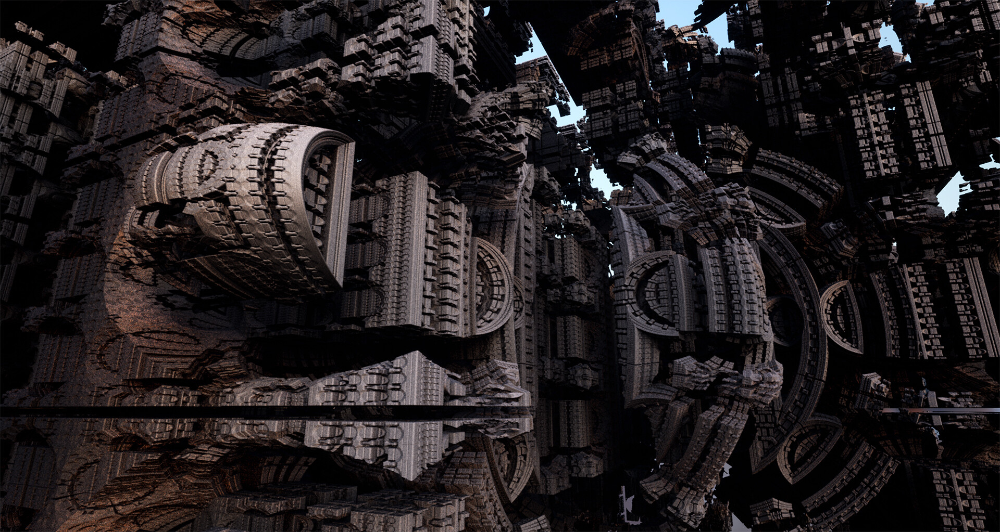

#  Fractal  
## Concept  
Une expérience de projection contemplative dans là quel on utiliserait la technique du Ray Marching pour se promener dans un environnement fait de fractale et de forme complexe mais agréable à regarder.

  
  

## Aspect technique  
Pour réaliser ce projet il faudrait en apprendre un peu plus sur le Ray Marching et son fonctionnement, ce qui ne devrait pas être trop dur car il est possible de trouver sans difficulté des exemples de code trouvable sur github pour comprendre son fonctionnement en jouant directement avec des projets créés par d'autres personnes.  
Une fois que nous avons mieux compris son fonctionnement nous pourrions faire notre propre projet pour créer un scène de fractal que l'ont pourrait simplement projeter sur un mur, un plancher ou un plafond.  

### exemple code et fontionnement :  
https://www.shadertoy.com/view/ts3XR7  
https://youtu.be/Cp5WWtMoeKg

## Exemple de Projet avec du Ray Marching
<iframe width="560" height="315" src="https://www.youtube.com/embed/N1oKIbDqo8g?si=RrnpQ-KhIfEWxiU_" title="YouTube video player" frameborder="0" allow="accelerometer; autoplay; clipboard-write; encrypted-media; gyroscope; picture-in-picture; web-share" allowfullscreen></iframe>  
